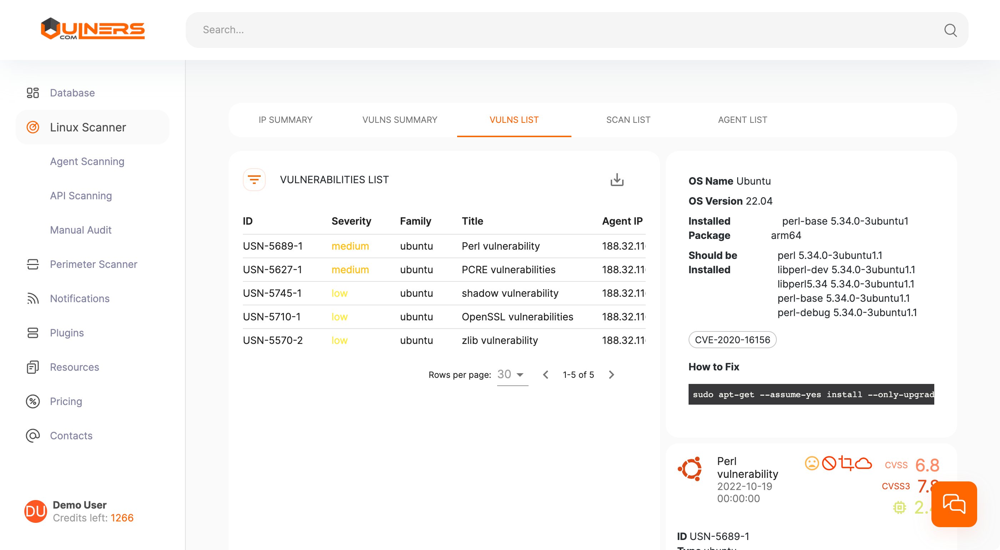

## Intro

This document describes how to search vulnerabilities in Docker containers using SBOM files and Vulners audit API. 

**A software bill of materials (SBOM)** is a formal, machine-readable inventory of all constituent components, software dependencies and their hierarchical relationships involved in the development and delivery of an application. Vulners API is a Python 3 library for the Vulners database. It provides search and vulnerability scanning APIs for integration purposes.

By combining these tools, we can have a simple solution for monitoring the security of an infrastructure built on Docker. 

## Prerequisites

- Python 3
- Syft
- Vulners-sbom script

## Generate SBOM

To generate SBOM we will use Syft. Install Syft with the following command.

```bash
curl -sSfL https://raw.githubusercontent.com/anchore/syft/main/install.sh | sh -s -- -b /usr/local/bin
```

For a detailed installation guide, see here <a href="https://github.com/anchore/syft#installation" target="_blank">Syft. Installation</a>

Use Syft to generate a SBOM for a container image and write it to a file.
You can use one of the following SBOM formats: Syft json, SPDX json, CycloneDX json or xml.

```bash
syft <image> -o json=/path/to/sbom/file.json 
syft <image> -o cyclonedx-xml=/path/to/sbom/file.xml
syft <image> -o cyclonedx-json=/path/to/sbom/file.json
syft <image> -o spdx-json=/path/to/sbom/file.json
```

## Generate Vulners API key

Now we should get an API key for agent registration. [Log in](https://vulners.com/userinfo) to Vulners, go to the userinfo space and click on the API KEYS tab.  In the "Scope" field, select "api", click SAVE and then copy the generated key. The result should look something like this:
**RGB9YPJG7CFAXP35PMDVYFFJPGZ9ZIRO1VGO9K9269B0K86K6XQQQR32O6007NUK**

## Run Vulners-sbom script

Download Vulners-sbom script form <a href="https://github.com/vulnersCom/vulners-sbom-parser" target="_blank">Github</a> and install the requirements.

```bash
git clone https://github.com/vulnersCom/vulners-sbom-parser.git
cd vulners-sbom-parser
pip install -r requirements.txt
```

Run script with your API key and SBOM file

```bash
python3 vulners-sbom-parser.py -i /path/to/sbom/file.json -k <YOUR_API_KEY_HERE>
Operation System: Ubuntu 22.04
Found 5 vulnerabilities
------------------------------------------------------------
Package                                  CVEs
------------------------------------------------------------
libpcre2-8-0 10.39-3build1 arm64         CVE-2022-1586, CVE-2022-1587
libssl3 3.0.2-0ubuntu1.6 arm64           CVE-2022-3358, CVE-2022-3602, CVE-2022-3786
login 1:4.8.1-2ubuntu2 arm64             CVE-2013-4235
passwd 1:4.8.1-2ubuntu2 arm64            CVE-2013-4235
perl-base 5.34.0-3ubuntu1 arm64          CVE-2020-16156
zlib1g 1:1.2.11.dfsg-2ubuntu9 arm64      CVE-2022-37434
```

The script collects from SBOM a list of packages installed in a container and calls Vulners audit API method. As an output you will get a list of vulnerable packages and vulnerabilities IDs. The results of scans are also stored in the [Vulners dashboard](https://vulners.com/linux-scanner). Here you can get more detailed information about discovered vulnerabilities.
